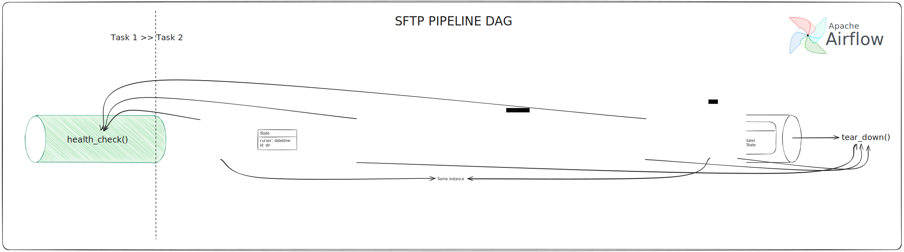

# Cake Assignment
A mono-repo of the Cake's interview assignment implementation.

The Problem Statement can be found [here](https://data-gcdn.basecdn.net/202404/sys8305/hiring/03/11/QRV9RRAVX8/7aa884f0dfabe41fc022bab038895a32/GPZ65NMB968ZG99L3RUYS39YAKKY43PUEZVKD5EZLUG536EZ7HEFXD4WVP79YDPBUPGQ2H4LWCWBNSKFJFMXUE/11/38/69/05/47/5942261e2293cffe4a5991c4664b420b/assignment_data_platform_team_cake.pdf).

##  Disclaimer
This exercise aims to depict the author's understanding about the Integrations industry 
and how abstractions are made to make Integration workload scalable without having to linearly scale the DE team.

This does not attempt to be an Airflow showcase. 
Therefore, well-known practices and features might not be adopted as the author has little experience using this,
and many of its features are considered redundant (some are even considered verbose, examples to be provided later) for this assignment.

The adoption of any should be based on use-cases and requirements. Further research will be made on-demand.

## Setup and Demographic
**While in the project's root**:
1. run:
```shell
docker-compose up -d
```
2. Observe the repository, the `sftp_volume_source` folder represent the source file system (it was mounted), and correspondingly the `sftp_volume_dest` for destination.
Initially, the source has several files, while the destination has none (there is a placeholder file that enables committing the folder for convenience's sake, you can skip them).

3. Go to `http://localhost:8080` and trigger the DAG `cake_sftp_pipeline`. Wait until the workflow finishes.
4. Come back to the repository and you will see that the data in the source has been transferred to the destination.
There was a transformation that convert all `\s` characters to `_` so you should see that effect in the destination.

> ***NOTE***
>
> You can add, delete or modified files in the sources and re-start from step 3 to see how data is sync accordingly.


## Context
The File System integrations imposes several assumptions:
* The data is unstructured, schema-less and acts as a container for other structured, semantic data.
It itself does not have business semantic.
* The file itself is atomic unit for transferring.
We cannot "partially" deliver a file without affecting the Data consistency.
* The data can be represented in 2 forms, either binary or plain text form.
However, file format is not considered due to the former points.
* Metadata is completely controlled by the Operating System.
* The only possible cursor used for incremental sync here is the updated timestamp of the file (most of the Data Sources also follow the same convention), but it is not always the only possible cursor.
* ...

These assumptions heavily affected how solution is designed:
* As the data is unstructured and does not have any semantic, 
there is no need for "Joining Transformation" where multiple entities are aggregated, since there is none.
It requires only on-the-fly transformation, where each of the bytes or character suffices as input for Transformation.
* Also, due to possible large file size, data chunking is needed.
This also leads to correctness of the transformation logic and requires advance technique to handle such cases
(for example, we need to replace any word `password` with `********`.
However, when syncing data in chunks, `Thepassword` might be chunked into `Thepas` and `sword`, causing the Transformer being unable to detect the desired token).
A minor optimization for performance is to sync data in binary form, avoid the cost of decoding (at source) and encoding (at destination) the data, but it also affects flexibility of the transformation.
* Operations on the source file system might affect data synchronization between the 2 server.
For example, copying a file and pasting, creating a new one retain the `last_modified_time` metadata on some OSs, causing it to be skipped when syncing if the original file is already synced, and the cursor of the pipeline moved up to a more recent timestamp.
* A timestamp cursor is hardcoded throughout the solution. In case a custom cursor is needed, the pipeline has to be "source-schema cognizant", which is incompatible in the current context as mentioned before. An unique id is supported to order the source data in case the cursors are the same between multiple data, and it also plays part in the pipeline's state.

## Solution Design


### 1. Interfaces represent the entities in a ETL pipelines: `Source`, `Destination`, `StateMachine`, `Transformer`, `DataPoint` and a `State`

* The `DataPoint` represents the data to be transferred.
The main requirement here is that it needs to be State-atomic, that is, the state will only be updated if the content of this entity is successfully written to the destination, 
partial written is not permitted, even if that content is semantically dividable. This feature allows chunking data on-demand while also maintains data consistency.

* The `Source` and `Destination` represent the "Airflow's Connections", with extra features added for ETL workload.
While the `Source` is required to sort its output `DataPoint` by state (to correctly move the cursor upward),
the `Destination` is required to be revertible if it fails to ingest any `DataPoint` (only for that `DataPoint` content), even if it is partially ingested.
The 2 requirements are needed to maintain data consistency.

* The `StateMachine` is quite simple, it persistently stores tuple of (cursor, id) and later retrieves that as per invocation. 
This ease the pressure of changing the state persistence layer. A `State` object is used to maintain pipeline state, which contains of 2 field, a timestamp cursor and an `id` field as per previously mentioned.

* The `Transformer` serves for on-the-fly transformation purpose. 
Joining transformation is currently not supported and will require a totally different mechanism.

* Any entity that performs IO with other services is required to perform health check before any ETL workload and perform tear down after workload regardless of the job's result
(let's assume that `Transformer` does not perform IO operation, or else this will form a pattern of Joining Transformation).

### 2. An implementation for the `Pipeline` as per above diagram (literally the same)

> ***NOTE*** 
> 
> The design declaration can be found in `$PROJECT_ROOT/dags/cake_airflow_custom_package/api.py`

## Implementations

SFTP Implementations to above interfaces are straight forward with few edge cases handling and "decorations":
* A `File` class was created to map with the author's mental model more easily.
* A `FileContent` implementation of `DataPoint` represent the content of the file atomically, 
while chunking its content to small byte arrays lazily to avoid OOM for big files.
* The `Source` implementation is straight forward by reading data in binary form in fix sized (1024 bytes) chunks,
while the `Destination` needs to handle revert, even for the case of already-exist file, by backing-up the file before processing the update operation. Both just leveraged the use of Airflow SFTP provider. Here the file's name is used as the `id` for state management.
* The `StateMachine` simply share the Airflow's Postgres, using `psycopg2` as its client.
* For simplicity, the `Transformer` here convert all `\s` characters to `_`. 
This can be done for a single character, which can be correctly proceeded in any data chunk without knowing the content of the next one (as chunking can not be done smaller than a single character).

The dag simply initializes a `Pipeline` with the desired implementation arguments and invokes its steps as `PythonOperator`s.

> ***NOTE***
>
> The interfaces implementations can be found in `$PROJECT_ROOT/dags/cake_airflow_custom_package/sftp.py` and `$PROJECT_ROOT/dags/cake_airflow_custom_package/pg_state_machine.py`

## Conclusion

This is quite a standard abstraction in the ETL industry, nothing much and impressive here. 
However, what is worth noting here is the many "niche" and minor issues that the author has encountered just by doing an arbitrary pipeline.
While most of them can be compromised or even walk-around with it, they usually violate the industry abstraction. 
Therefore, we should be extra careful when designing, identify the "nature" of each problem and decide whether we should walk-around with this as an edge case, or rethink our architecture and knowledge base.
The author himself struggled a lot while adapting with the assumptions and the adoption of Airflow into his solution.

### Concerns on Airflow

While Airflow provide such a tremendous feature set, many of them are overkilled for this problem:
* Operator for each task: abstraction can be done at code structure level instead of operational level. 
While this allow easy maintenance in large scale, it also has downsides:
  * Some Executors might execute the tasks in separate processes, containers, or even pods (in a K8s environment). 
  This increases the risks of IO failure (between processes at disk level, or between pods at network level). This also incurs extra cost of containers, processes, pods initialization.
  * Dramatically increase the complexity of state management. 
  Input, output and status of each task must be kept and updated regularly as input for the next, making its mental model extra complicated (while some of them are rendered useless after the job).
* Sensors: the author found this an interesting feature of Airflow. However, he couldn't fit it to the use-case while making huge impact from it, especially for batch-processing problems.

He did make an impactful adoption of the Operator by splitting the pipeline into 2 tasks.
The first one performs health check on IO-ing entities, while the second one performs the heavy workload and depends on the former's result. 
This ensures that the ETL workload won't run on such abnormal situation which might cause data inconsistency.

He also appreciates the concept of "Code as Manifest" that Airflow implicitly introduced in its initialization instruction. 
By mounting the source code volume to the actual container and support hot-reload, 
the author can iteratively verify his coding result on Airflow UI without having to rebuild the whole project.
The development experience, hence, was enjoyable.

However, he is skeptical about adopting this practice in a Production environment.
He tried separating his abstraction into a package that can be installed as a Python library.
Doing this also require `docker-compose.yml` to build the image from in his custom `Dockerfile` with specific name. 
This worked and also leveraged the standardized pip package manager for code preference instead of the Airflow's "hacking" way of mutating the `PYTHONPATH` environment variable, but it eliminated the hot-reload benefit, so he decided to go with the previous approach. 
By doing this, he has found better way to structure code for Production deployment. 
Too sad it was committed as deleted from the repo as it became redundant.

### What could be improved
* [SEVERE] - The transformer has a risk (though low rate) of performing wrong logic in case the chosen decoder of the `Transformer` is incompatible with the `Source` data encoded format. 
Furthermore, there is an implicit dependency between the `SFTPSource` implementation chunking size and the encoding algorithm. The algorithm might introduce bytes size for each character larger than 1024 bytes, leading to un-interpretable data while transforming (which is unlikely as the most popular encoding standard is `utf-8`).
The author considers this severe as this is a total surprise to the `Transformer` implementor and is extremely difficult to debug. The risk and trade-off is left for the interviewer to judge. The proposed solution (but low performance) would be to write raw data at destination and transform there, which costs double IO bandwidth.
* The SFTP servers can be deployed as a single one, and the namespacing between the Source and Destination can be done via ACL.
* SSH keys of the SFTP servers is committed to the repo for convenience's sake (without compromising the security). 
However, it is a better practice to not exposing any SSH private key.
* More Airflow adoption to the solution: To be honest, the author did try his best to adopt as much Airflow features as possible. 
However, it was either incompatible with his design or it would not depict his knowledge base at best. 
He might need time to truly get used to this in a conceptual manner. However, technically, he is confident that he can get his hand dirty with Airflow almost immediately (and he did prove it).

